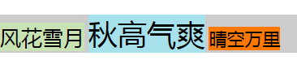

# 不同字体大小在同行文本中的显示
## 默认情况
默认情况下，vertical-align以baseline作为对齐标准，表现为以文本的底部对齐。每个span的内容区域由它的line-height决定，而line-height = font-size * 默认值，所以字体更大的文本得到的空白部分就会更多，表现为字体小的文字背景内容会距离下方有一定的间隔。

## 居中对齐
居中对齐只需要将默认的baseline，设置为middle即可
```
  .row span {
      vertical-align: middle;
    }
```
## 文字底部对齐

